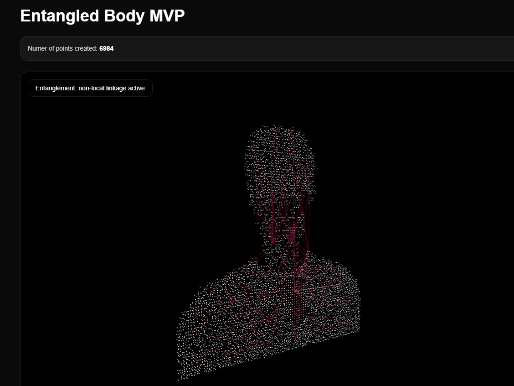

# Entangled Body (Minimal Implementation)

A minimal interactive prototype of **Entangled Body: A Quantum-Inspired Interactive Experience of the Human Body**

This repository contains a lightweight implementation focused on **2D core animation and interaction behavior**, designed to test the visual and structural foundations of the full system.
Our real project will be in 3D with utilizing the 3rd party human body model and real quantum hardware.

## 2D rendering


---

## Overview

This prototype represents the human body as a **dynamic point cloud** that continuously shifts between structure and dispersion.

Rather than a complete system, this implementation isolates a key idea:

> **Form is not fixed — it emerges from interaction and perspective.**

The animation demonstrates how a coherent structure can dissolve into particles and reassemble over time, hinting at the concepts of:

- Superposition (ambiguous structure)
- Collapse (emergence of form)
- Continuous state transition

---

## What This Implementation Includes

- Minimal point cloud animation
- Transition between structured and dispersed states
- Basic rendering pipeline using Three.js / React Three Fiber
- Lightweight setup for fast iteration

---

## What This Does NOT Include (Yet)

This is an early-stage prototype. The following features are **not implemented**:

- Non-local interaction (entanglement mapping)
- Probabilistic interaction system
- User-driven measurement (hover/click effects)
- Quantum-generated data integration (Qiskit / IonQ)

---

## Tech Stack

- Next.js
- React
- Three.js
- React Three Fiber

---

## Getting Started

```bash
npm install
npm run dev
